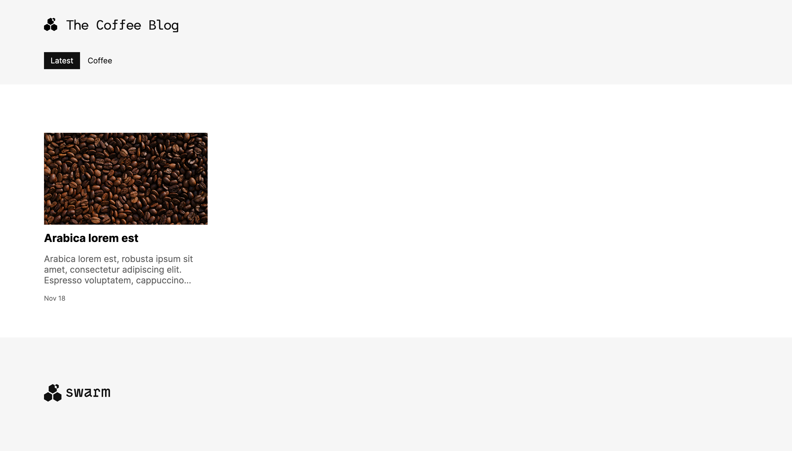

Etherjot is a demo web3 blog-publishing application built on the Swarm network.

## Screenshots

## Features

-   Markdown editor
-   Categories and tags for organizing content
-   Built-in asset browser and management
-   Publishing directly on decentralised storage
-   Configurable elements like header, footer and main page layout
-   Extension: Donation component to accept tips and topups
-   Extension: Decentralised commenting

## Setup

1. Execute: `npm install` (Only once)
2. Start the application: `npm start`

## Testing with `bee`

Ensure you have `bee` version `1.16.1` for compatibility with `dev` mode.

1. Download `bee` from [this link](https://github.com/ethersphere/bee/releases/tag/v1.16.1).
2. Provide execution permissions: `chmod +x <downloaded_binary_name>`
3. Initiate: `./bee dev --cors-allowed-origins="*"`
4. Generate a postage batch using: `curl -X POST http://localhost:1635/stamps/100000000/24`
